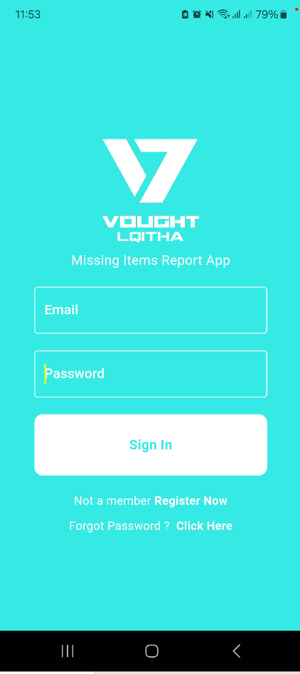
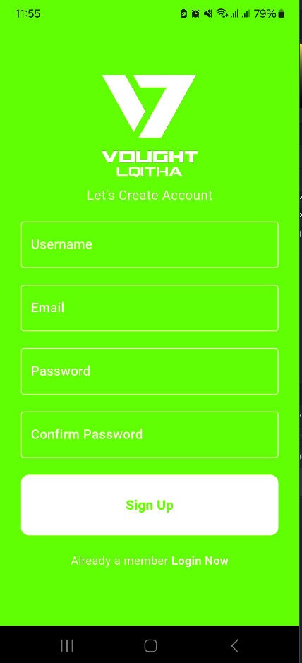
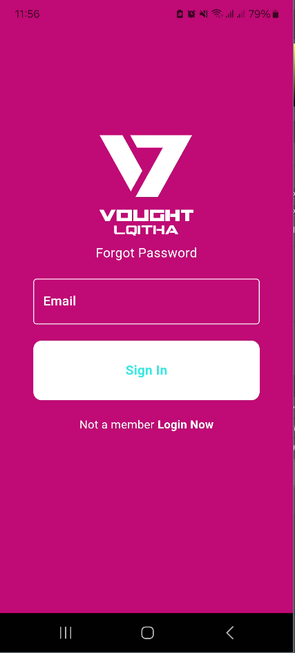

### VOUGHT LQITHA: Community-Driven Lost and Found App

#### Overview
VOUGHT LQITHA is a powerful mobile application that leverages community engagement to help users find lost items. Built using Flutter and Firebase, VOUGHT LQITHA allows users to report found items and search for their lost belongings within a supportive network of users.
#### UI of the app
##### Login Page

##### Register Page

##### Forgot Password Page

#### Key Features

1. **Report Found Items**
   - **Easy Reporting:** Users who find lost items can quickly report them by providing a description, location, and photo. This information is instantly uploaded to the Firebase database, making it available to the community.
   - **Geotagging:** The app uses geotagging to mark the exact location where the item was found, helping the owner to locate it easily.

2. **Search for Lost Items**
   - **Comprehensive Search:** Users can search for their lost items by entering relevant keywords, categories, or filtering by location. The app searches the Firebase database to find matching reports.
   - **Real-time Updates:** Receive real-time notifications when a matching item is reported, increasing the chances of a successful recovery.

3. **User Profiles and Verification**
   - **Profile Creation:** Users create profiles with verified contact information, ensuring secure and trustworthy interactions.
   - **Item Claim Verification:** To claim a lost item, users must provide details that match the report, adding a layer of security to prevent false claims.

4. **Community Engagement**
   - **Notifications and Alerts:** Stay informed with push notifications about new found items or status updates on reported items.
   - **Chat Functionality:** Secure in-app messaging allows users to communicate directly for additional information or to arrange item retrieval.

5. **Seamless Integration**
   - **Flutter and Firebase:** The app is built using Flutter, ensuring a smooth and responsive user experience across both Android and iOS platforms. Firebase provides a robust backend with real-time database capabilities, authentication, and cloud storage.

6. **Privacy and Security**
   - **Data Protection:** VOUGHT LQITHA prioritizes user privacy with secure data encryption and storage practices. Personal information is protected, and location data is used solely for the purpose of finding lost items.

#### How It Works

1. **Report a Found Item**
   - Open VOUGHT LQITHA and navigate to the "Report Found Item" section.
   - Enter details such as item description, photo, and location.
   - Submit the report to add it to the community database.

2. **Search for a Lost Item**
   - Open VOUGHT LQITHA and go to the "Search Lost Items" section.
   - Enter keywords, select a category, or filter by location to find matching reports.
   - Review the results and contact the person who reported the found item through the in-app chat.

3. **Claim Your Item**
   - Verify your claim by providing matching details to the person who reported the found item.
   - Arrange for the item's return through secure communication facilitated by the app.

VOUGHT LQITHA creates a community-driven solution for finding lost items, making the process easier, faster, and more secure. Join the VOUGHT LQITHA community today and contribute to a network where everyone looks out for each other.
